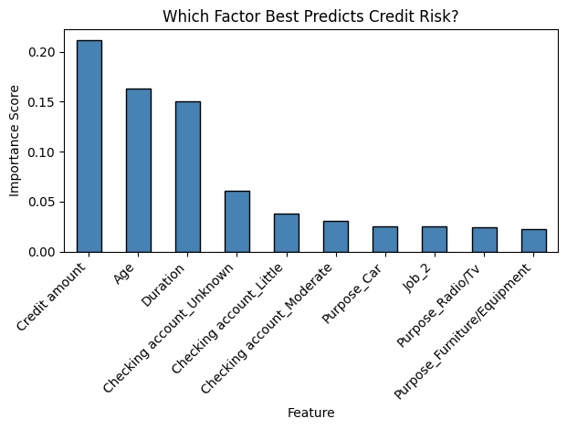
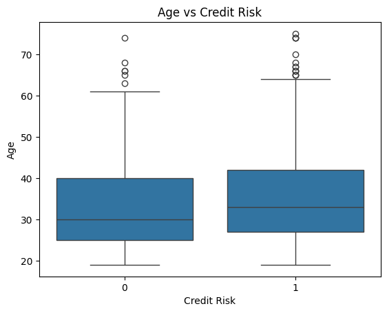
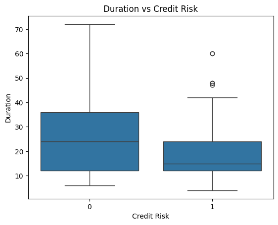
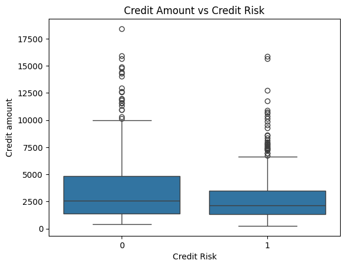

# Credit Risk Predictor

A machine learning project that predicts whether a borrower is a 
credit risk based on their financial details.

Built by Hari Prasaad — Year 1 Computer Science Student

---

## Live App

Try it here → [Credit Risk Predictor](YOUR_STREAMLIT_LINK_HERE)

---

## What it does

This project analyses real financial data from 1000 borrowers and 
predicts whether a person is a High Risk or Low Risk borrower based on:

- Credit Amount — how much money they are borrowing
- Age — the borrower's age
- Loan Duration — how many months they have to repay

The app takes these three inputs and instantly predicts the credit 
risk with a probability score shown on a gauge chart.

---

## Files in this repository

| File | Description |
|---|---|
| `app.py` | Streamlit web app |
| `requirements.txt` | Python packages needed |
| `credit_risk_project.ipynb` | Full analysis notebook |
| `README.md` | Project documentation |
| `age_vs_risk.png` | EDA chart |
| `duration_vs_risk.png` | EDA chart |
| `credit_amount_vs_risk.png` | EDA chart |
| `feature_importance.png` | Random Forest feature importance chart |

---

## Project Structure

- Data loading and cleaning
- Exploratory Data Analysis using seaborn and matplotlib
- Random Forest to identify the most important features
- Logistic Regression model to predict credit risk
- Streamlit web app for public use

---

## Key Findings

### Which factor best predicts credit risk?


### Age vs Credit Risk


### Duration vs Credit Risk


### Credit Amount vs Credit Risk


---

## Insights from the data

- Credit amount was the strongest predictor of credit risk at 0.21 
  importance score
- Surprisingly, lower risk borrowers tended to have longer loan 
  durations — suggesting banks approved longer loans for stronger applicants
- Older borrowers appeared more in the high risk group — possibly 
  due to fixed pension income and fewer working years remaining
- The dataset reflects real historical German credit data from the 
  1990s and contains known biases around Sex and ForeignWorker columns

---

## Tech Stack

- Python
- pandas, numpy
- scikit-learn
- seaborn, matplotlib
- plotly
- Streamlit

---

## How to run locally
```bash
pip install -r requirements.txt
streamlit run app.py
```

---

## Dataset

German Credit Dataset — sourced from Kaggle
Original data from UCI Machine Learning Repository
1000 borrowers, collected in 1990s Germany
Credit amounts in Deutsche Marks (DM)

---

## Model Performance

- Algorithm: Logistic Regression
- Features used: Credit Amount, Age, Loan Duration
- Accuracy: 69%
- Note: Accuracy is modest because only 3 features are used.
  The model demonstrates that these three variables alone carry 
  significant predictive power for credit risk.

---

## Note

The Streamlit app uses Credit Amount, Age and Duration together 
for predictions. The Colab notebook demonstrates Logistic Regression 
using Credit Amount alone as a simplified educational example.
